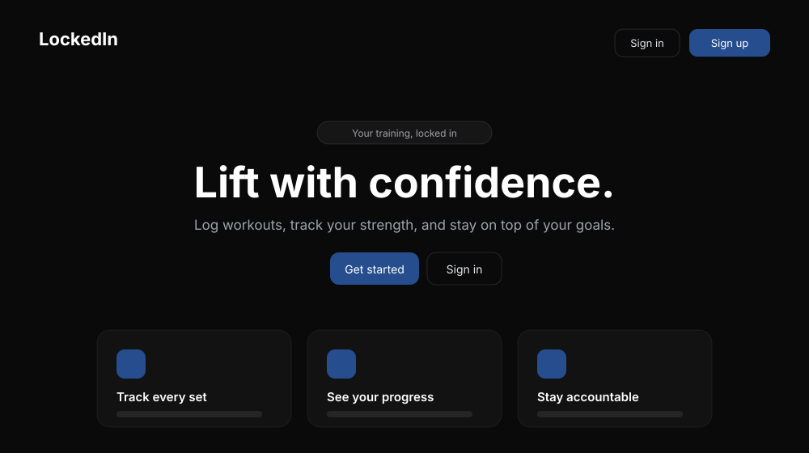
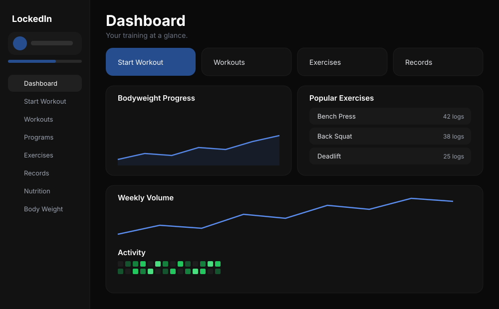
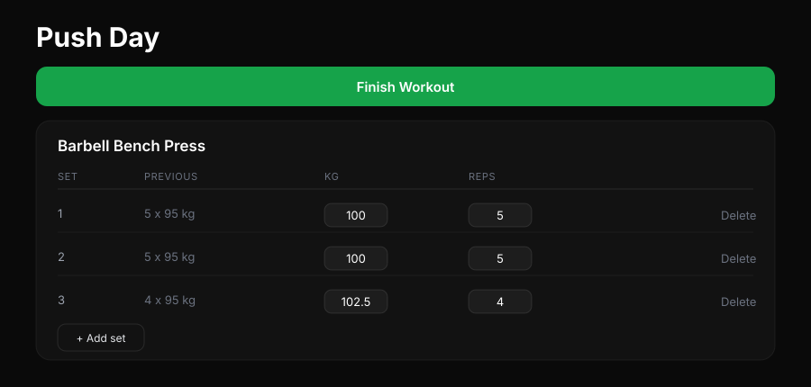
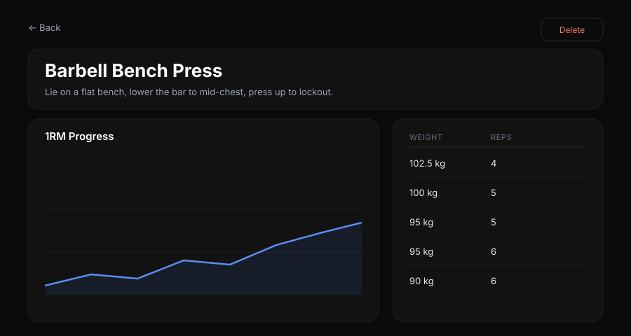
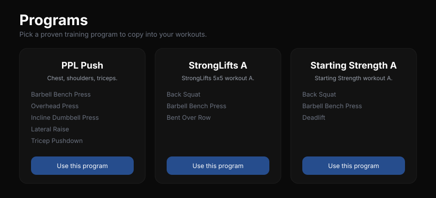
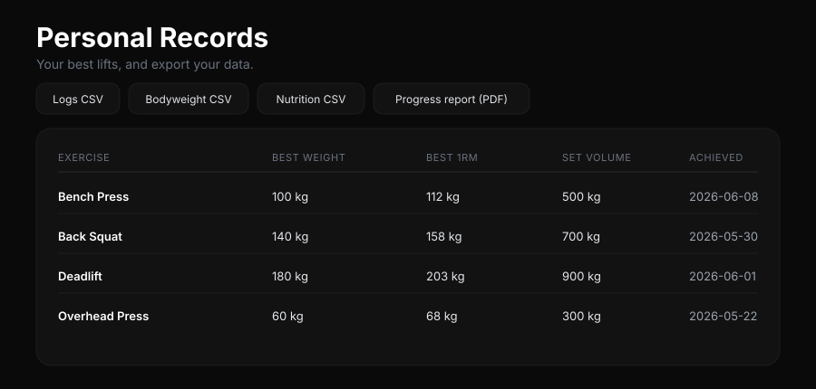
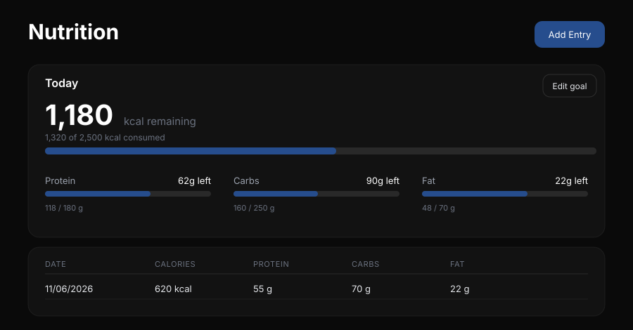
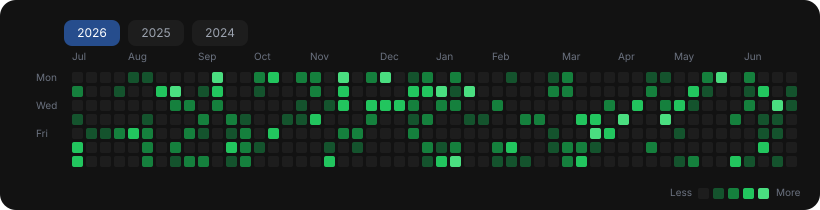

<div align="center">


# LockedIn

**A full-stack fitness tracker for logging workouts, tracking strength, and staying on top of your goals.**


</div>

<p align="center">
  
</p>

LockedIn is a progressive web app built with **Next.js (App Router) and TypeScript**. Workouts and progress are stored in **PostgreSQL via Prisma**, auth is handled by **NextAuth**, and the whole stack runs with a single `docker compose up`.

> The previews below are stylised SVG mockups of the interface (same dark theme, layout and palette as the running app).

---

## Features

### Dashboard
Everything at a glance — quick actions, your bodyweight trend, most-trained exercises, weekly volume, and a GitHub-style activity heatmap that rolls to today.

<p align="center"></p>

### Workouts and a live set tracker
Build workouts from your exercises and run a live session that records each set, shows your previous numbers, and awards XP when you finish.

<p align="center"></p>

### Exercises and automatic 1RM
Log weight × reps and LockedIn estimates your one-rep max (Brzycki formula) and charts it over time. Pick from a built-in library of 30+ exercises tagged by muscle group, or add your own.

<p align="center"></p>

### Prebuilt programs
Start from proven programs — Push/Pull/Legs, StrongLifts 5×5, Starting Strength — and copy them into your account in one click.

<p align="center"></p>

### Personal records and data export
Track your best weight, estimated 1RM and set volume per exercise, and export everything to CSV or a generated PDF progress report.

<p align="center"></p>

### Nutrition with daily goals
Set a daily calorie & macro goal, log meals (enter calories or auto-calculate them from macros), and see what's remaining for the day.

<p align="center"></p>

### Activity heatmap and gamification
A full trailing-year contribution graph (with a year selector for history) plus an XP/level system that rewards consistency.

<p align="center"></p>

---

## Tech stack

| Layer | Tech |
|------|------|
| Framework | Next.js 14 (App Router, Server Actions) · React 18 · TypeScript |
| Database | PostgreSQL · Prisma ORM |
| Auth | NextAuth (credentials, bcrypt) |
| UI | Tailwind CSS · MUI Joy · React Icons |
| Charts | Chart.js · custom contribution heatmap |
| Validation | Zod |
| PDF / export | @react-pdf/renderer · CSV |
| Testing | Vitest |
| Tooling | Docker · docker-compose |

---

## Getting started

### Option A — Docker (recommended)

Runs the app **and** PostgreSQL, applies migrations, and seeds the exercise library + programs automatically:

```bash
docker compose up --build
```

Then open **http://localhost:3000**. Set `AUTH_SECRET` via an `.env` file (see `.env.example`) for anything beyond local use — generate one with `openssl rand -base64 32`.

### Option B — Local

```bash
cp .env.example .env          # set DATABASE_URL and AUTH_SECRET
npm install
npx prisma migrate deploy     # create the tables
npm run seed                  # load the exercise library + programs
npm run dev
```

---

## Testing

Unit tests (1RM math, validation, analytics, XP, nutrition, CSV) run with [Vitest](https://vitest.dev/):

```bash
npm run test          # run once
npm run test:watch    # watch mode
```

---

## Screenshots

The previews above are stylised SVG mockups in [`docs/screenshots/`](docs/screenshots). To swap in real screenshots of your running instance, see that folder's README for the filenames and a capture guide.
